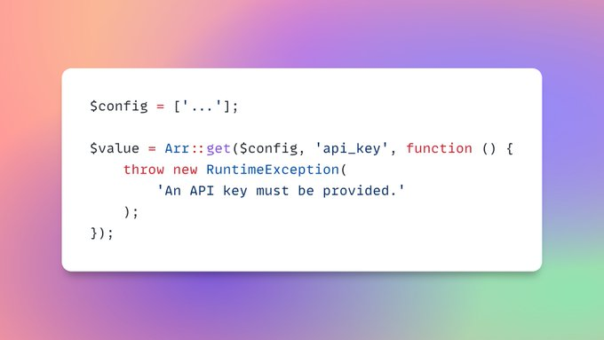

# Test Arr-Helper

- [throw an exception](#throw-an-exception)

## Throw an exception



```php
$config = ['.......'];
$apiKey = Arr::get($config, 'api_key', fn () => throw new Exeption('your message here'));

// or
$apiKey = $config['api_key'] ?? throw new Exeption('your message here'));
```
- [Original tweet by Steve Bauman](https://twitter.com/realstevebauman/status/1557393557735997443)
