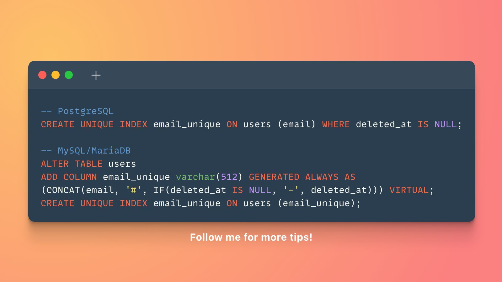

# Database Tips

- [unique columns](#unique-columns)

## Unique columns




__Laravel Example 1__:

```php
DB::update("
    ALTER TABLE tournament_league_game_days
    ADD COLUMN game_schedule_day_unique varchar (512)
    GENERATED ALWAYS AS
    (
        CONCAT(
            CONCAT(day, '#', game_schedule_id),
            '#',
            IF(deleted_at IS NULL, '-',  deleted_at)
        )
    ) VIRTUAL;

");
DB::update("
    CREATE UNIQUE INDEX game_schedule_day_unique ON tournament_league_game_days (game_schedule_day_unique);
");
```

__Laravel Example 2__:

```php
Schema::table('tournament_league_game_days', function (Blueprint $table) {
    $table->string('game_schedule_day_unique')
        ->virtualAs(
            DB::raw(
                "CONCAT(
                    CONCAT(day, '#', game_schedule_id),
                    '#',
                    IF(deleted_at IS NULL, '-',  deleted_at)
                )"
            )
        );
});

Schema::table('tournament_league_game_days', function (Blueprint $table) {
    $table->unique(['game_schedule_day_unique'], 'game_schedule_day_unique_index');
});
```

- [Original tweet by Tobias_Petry.sql](https://twitter.com/tobias_petry/status/1454085321180819457?s=12)
