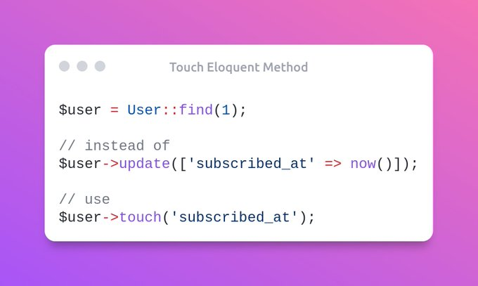

# Eloquent Tips

- [Touch Eloquent Method](#touch-eloquent-method)

## Touch eloquent method



```php
$user = User::find(1);

// instead of
$user->update(['subscribed_at' => now()]);

// use
$user->touch('subscribed_at');
```

- [Original tweet by Oussama Sid](https://twitter.com/sky_0xs/status/1557673614345895936)
