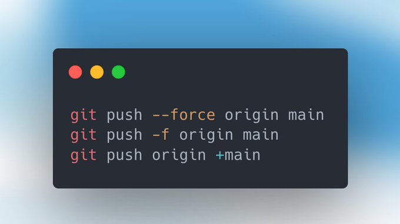

# Git Tips

- [Force push git branches](#force-push-git-branches)

## Force push git branches



```git
git push --force origin main
git push -f origin main
git push origin +main
```

- [Original tweet by Stefan Judis](https://twitter.com/stefanjudis/status/1558824620039585795)
